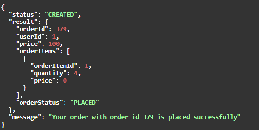
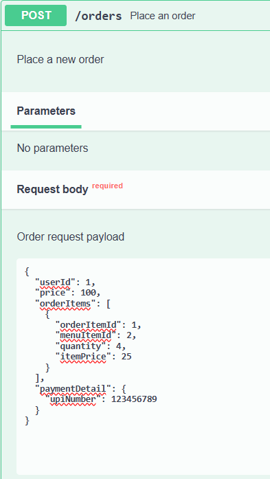
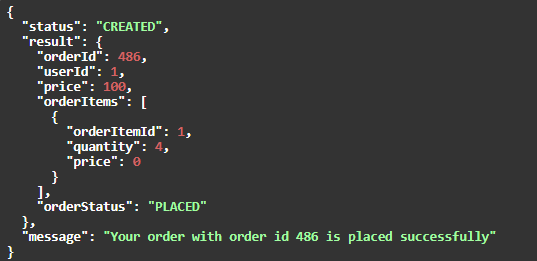
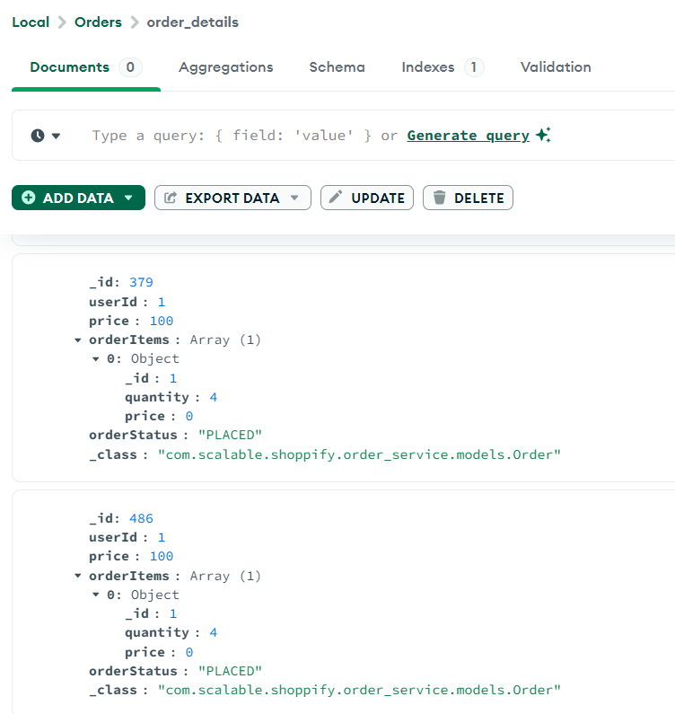
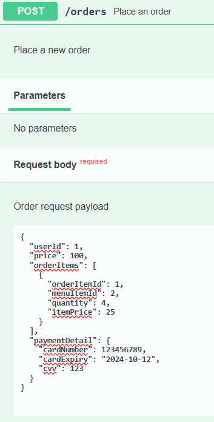
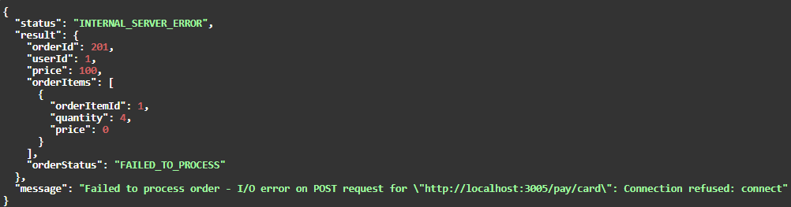
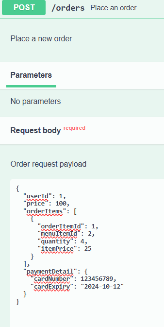
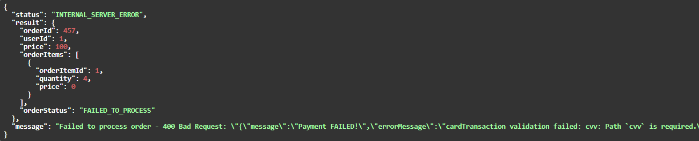
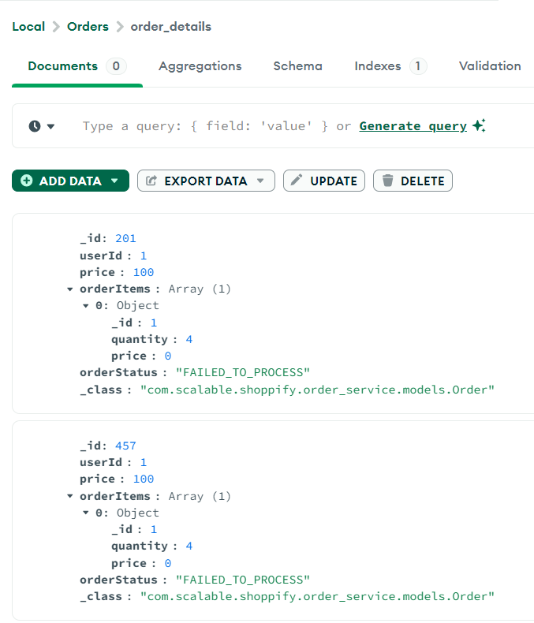

# OrderService
This microservice is built as part of Scalable-Services-Assignment.
It is built using Java Spring Boot & MongoDB.

### Steps to run locally

- Download & Install Java by following steps [here](https://www.geeksforgeeks.org/how-to-download-and-install-java-for-64-bit-machine/)

- Download & Install MongoDB by following steps [here](https://www.geeksforgeeks.org/how-to-install-mongodb-on-windows/)

- Clone this project

- Run `.\gradlew build` (only for 1st time)

- Run `.\gradlew bootRun`  to run the application

- Application will now be running on `http://localhost:8082`

- You can interact with the available endpoints either using Postman or by visiting Swagger - `http://localhost:8082/swagger-ui/index.html`

### API Documentation

- **Get All Orders**
  - URL: /orders
  - Method: GET
  - Description: Retrieve a list of all orders.
  - Responses:
    - 200 OK: Successfully retrieved list of orders.
    - 500 Internal Server Error: Error occurred while processing the request.

- **Place an Order**
  - URL: /orders
  - Method: POST
  - Description: Place a new order.
  - Request Body:
    ```json
    {
      "userId": 1,
      "price": 100,
      "orderItems": [
        {
          "orderItemId": 1,
          "menuItemId": 2,
          "quantity": 4,
          "itemPrice": 25
        }
      ],
      "paymentDetail": {
        "cardNumber": "123456789",
        "cardExpiry": "2024-10-12",
        "cvv": 123
      }
    }
    ```
    ```json
    {
      "userId": 1,
      "price": 100,
      "orderItems": [
        {
          "orderItemId": 1,
          "menuItemId": 2,
          "quantity": 4,
          "itemPrice": 25
        }
      ],
      "paymentDetail": {
        "upiNumber": "123456789"
      }
    }
    ```
  - Responses:
    - 201 Created: Order successfully placed.
    - 500 Internal Server Error: Error occurred while processing the request.


### Flow of the Service

- **Get All Orders**
  - User requests to get all orders.
  - All orders are fetched from the database and returned to the user.
  - If there is any error, an error message is returned.
  
- **Place an Order**
  - User places an order by providing the required details.
  - Order Id is Generated
  - Payment is processed by calling the **PaymentService**, which is another microservice.
  - If no exceptions, order status is updated to '**PLACED**' and success message is returned.
  - if payment fails or there is any other failure, order status is updated to '**FAILED_TO_PROCESS**' and failure message is returned.
  - Order is saved in - ( Database **Orders** / Collection **order_details** )
  - Notification about either Order Success or Order Failure is sent to user, by calling **NotificationService**, which is another microservice.

## Success

#### _API Request/Response_

**When Payment is successful using card:**
- 
- 

**When Payment is successful using UPI:**
- 
- 

#### _MongoCollection_
- 

## Failure

#### _API Request/Response_

**When Payment Service is down:**
- 
- 

**When Payment fails due to insufficient parameters:**
- 
- 

#### _MongoCollection_

- 

